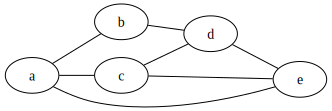

# Python DAG Generator
> A simple Python application to generate DAGs from a CSV

## Example Input
Create a CSV file defining the dependency relationships in the following structure: 

| dependency | dependent |
| --- | --- |
| a | b |
| a | c |
| b | d |
| c | d |
| a | e |
| c | e |
| d | e |

## Example Output
