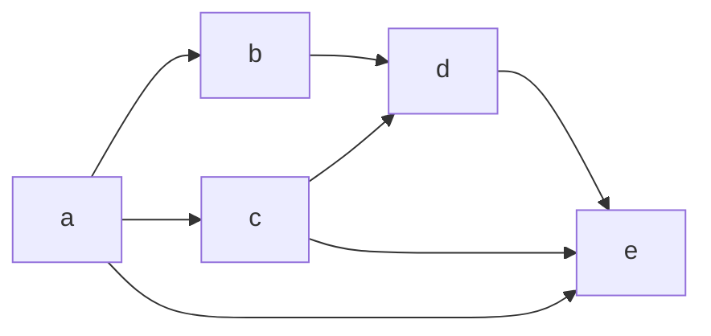
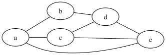

# Python DAG Generator
> A simple Python application to generate DAGs from a CSV in either Mermaid or GraphViz format

## Instructions

1. **Install GraphViz** (only required if running in `graphviz` mode):
   - For Mac: [GraphViz via Homebrew](https://formulae.brew.sh/formula/graphviz)
   - For Windows: [GraphViz download page](https://graphviz.org/download/)

2. **Set up a virtual environment** and install the required packages:
   - Run `pip install -r requirements.txt` after creating and activating your virtual environment.

3. **Run the Python script** using the following flags:
   - `-i` to specify the path to the input CSV file.
   - `-m` to specify the output mode, either `graphviz` or `mermaid`.

   Example commands:
   - To generate a **Mermaid diagram** (no GraphViz installation required):
     ```bash
     python main.py -i input/example.csv -m mermaid
     ```
   - To generate a **GraphViz diagram** (GraphViz installation required):
     ```bash
     python main.py -i input/example.csv -m graphviz
     ```

4. **Output location**: The script will save the output files in the `output/` directory. Note that this directory will be cleared every time the script is run.

## Example Input

Create a CSV file defining the dependency relationships in the following structure: 

| dependency | dependent |
| --- | --- |
| a | b |
| a | c |
| b | d |
| c | d |
| a | e |
| c | e |
| d | e |

## Example Output

### Mermaid


```mermaid
graph LR
    a --> b
    a --> c
    b --> d
    c --> d
    a --> e
    c --> e
    d --> e
```

### GraphViz

